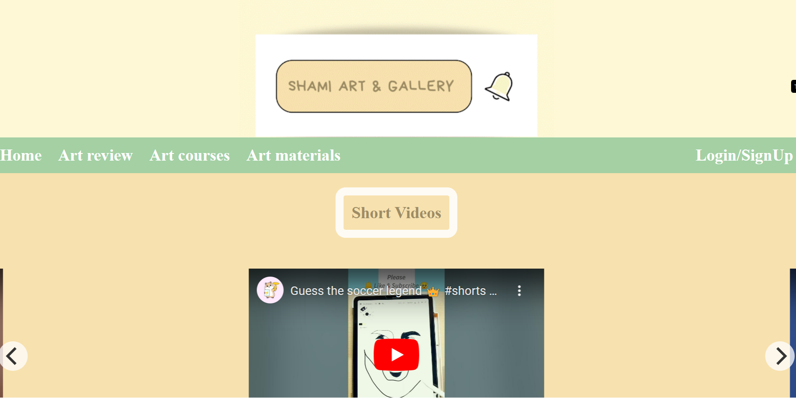

# Shami's Art Gallery: An Online Hub for Creative Exploration

*Figure 1: Home Page*

Shami's Art Gallery: An Online Hub for Creative Exploration
Shami's Art Gallery is a comprehensive online platform designed to inspire and facilitate artistic engagement for creators of all levels. Developed by founder and CEO Shami Islam Khan, this website provides a rich collection of resources, from captivating visual content to insightful educational materials, fostering a deeper connection with the world of art.

## Project Overview
Shami's Art Gallery serves as a dynamic online space where users can explore various facets of art through short videos, in-depth art reviews, practical art courses, and unique downloadable materials. The project aims to democratize art education and appreciation, making it accessible and engaging for a wide audience.

## Key Features
🎥 Video Content
✍️ Art Reviews
📚 Art Materials & Resources
🌐 Interactive Elements

## Technologies Used
HTML5 for structural content.
CSS for styling and layout.
JavaScript for interactive elements (e.g., carousel functionality).
Flickity library for responsive carousels.

##
Contributors
Shami Islam Khan: Founder, CEO, and Project Lead.
Connect with Shami Islam Khan
Linkedin: https://www.linkedin.com/in/shami-islam-khan/
Instagram: https://www.instagram.com/shami_islam_khan/?hl=en
Facebook: https://www.facebook.com/shamiislamkhan